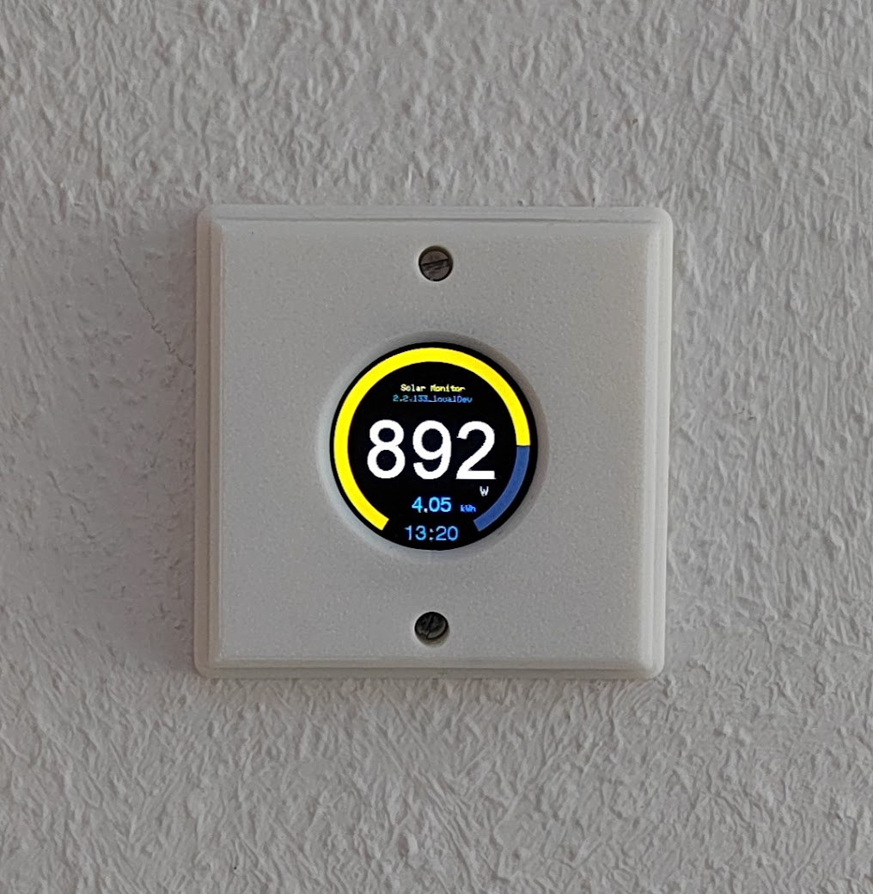
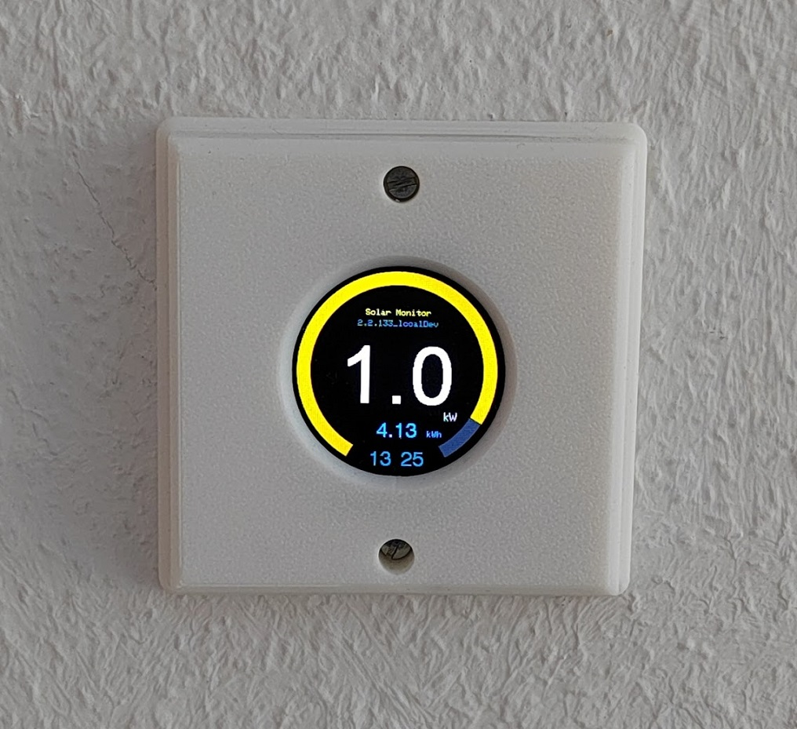
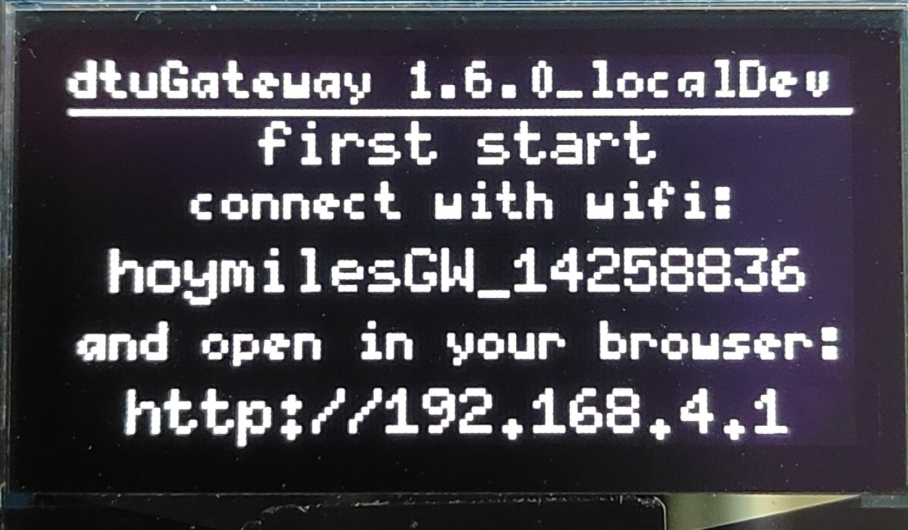
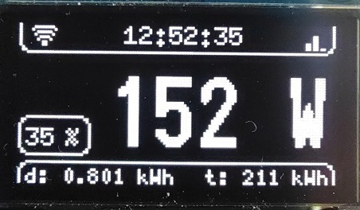
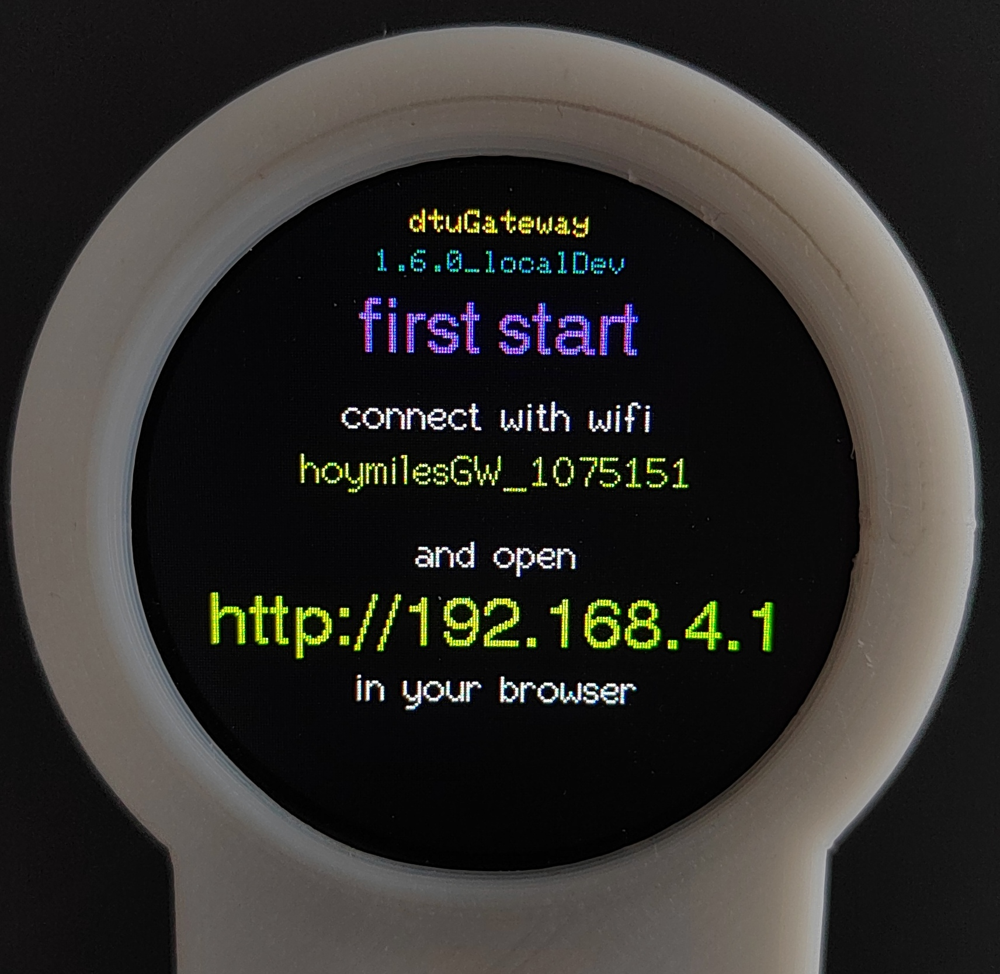
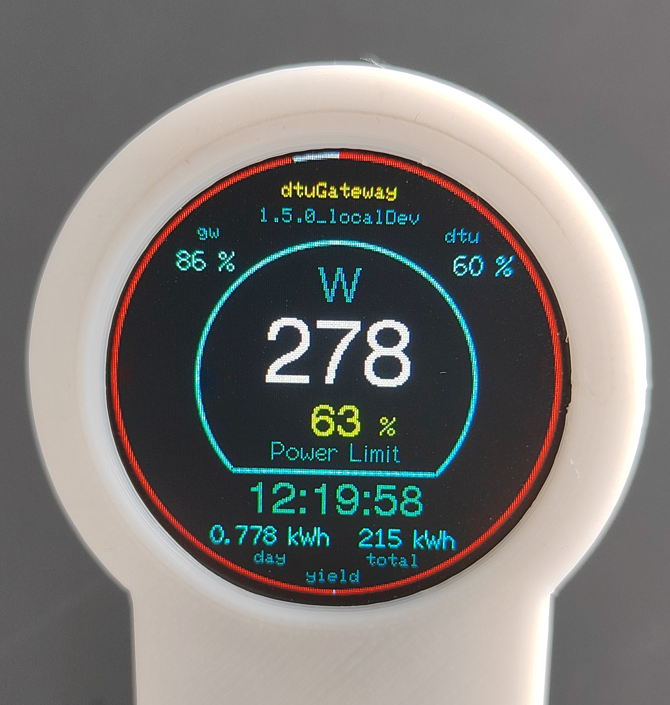

# dtu Gateway for Hoymiles HMS-xxxW-2T (2T series)

## Contents
- [dtu Gateway for Hoymiles HMS-xxxW-2T (2T series)](#dtu-gateway-for-hoymiles-hms-xxxw-2t-2t-series)
  - [Contents](#contents)
  - [problem](#problem)
  - [goal](#goal)
  - [ESP8266 maintenance path](#esp8266-maintenance-path)
  - [features](#features)
    - [regarding dtu](#regarding-dtu)
      - [dtu connection](#dtu-connection)
      - [connections to the environment](#connections-to-the-environment)
      - [display support](#display-support)
    - [regarding base framework](#regarding-base-framework)
  - [api](#api)
    - [data - http://\<ip\_to\_your\_device\>/api/data.json](#data---httpip_to_your_deviceapidatajson)
    - [info - http://\<ip\_to\_your\_device\>/api/info.json](#info---httpip_to_your_deviceapiinfojson)
  - [openhab integration/ configuration](#openhab-integration-configuration)
  - [MQTT integration/ configuration](#mqtt-integration-configuration)
  - [known bugs](#known-bugs)
  - [installation](#installation)
    - [hardware](#hardware)
    - [first installation to the ESP device](#first-installation-to-the-esp-device)
      - [example for ESP32](#example-for-esp32)
      - [first setup with access point](#first-setup-with-access-point)
      - [return to factory mode](#return-to-factory-mode)
    - [update](#update)
  - [releases](#releases)
    - [main](#main)
    - [snapshot](#snapshot)
  - [troubleshooting](#troubleshooting)
  - [experiences with the hoymiles HMS-800W-2T](#experiences-with-the-hoymiles-hms-800w-2t)
    - [set values - frequency](#set-values---frequency)
    - [hoymiles cloud update](#hoymiles-cloud-update)
    - [sources](#sources)
  - [build environment](#build-environment)
    - [platformio](#platformio)
    - [hints for workflow](#hints-for-workflow)


## problem
The newer series of Hoymiles inverter with internal wireless access point and wireless client have no direct API to include this endpoint in smarthome installations/ IFTT environments.

Usually there should be no need for an extra device to "translate" the connection to common APIs or bindings. Unfortunately the interface on the dtu is unlikely unstable/ or not really stable.

E.g. there is a threshold of ~ 31 seconds before you can send new data to the dtu (e.g. new power limit), otherwise the connection hangs and an internal restart/ reboot (???) leads to an offline time of ~ 30 minutes. 
Data from dtu can be read in a very short time, but it has to be tested how often a request leads to the problem before.

On a manual way you can be back on track, if you are logging in to the local access point of the dtu and resend your local Wi-Fi login data to (it seems) initiate a reboot. With this way you can be back online in ~ 1:30 minutes.

So I decided to put this abstraction in an **ESP32** to have a stable abstraction to an existing smart home environment.

> *hint: the whole project could be also implemented on a small server and translated to e.g. python [see here for an example](https://github.com/henkwiedig/Hoymiles-DTU-Proto) and also the sources below*

## goal
1. Abstract the interface to the dtu (inverter connection endpoint) with different possibilities to connect to other systems. (push/ pull)
2. Very stable interface with no dependencies to an environment/ a system with a standalone application based on an Arduino board (ESP32).
3. TODO: Ability to change running Wi-Fi to connect to dtu over local network or direct access point.
4. Use this need to create a full environment for an ESP32 based project. (see features below)

## ESP8266 maintenance path

The project was started with an ESP8266. Due to some further implementations the ESP8266 was not capable anymore for the new features - therefore a maintenance branch was forked with the base functionalities until version 2.0.

https://github.com/ohAnd/dtuGateway/tree/esp8266_maintenance

This branch will be maintained with small bug fix, if needed.

## features

### regarding dtu

#### dtu connection
- base connection to retrieve data from inverter e.g.
  - power (Watts), voltage (V), current (A) for the PV input data (PV0,PV1) and the grid
  - energy counter (kWh) for all 3 sources (day and total)
  - temperature and Wi-Fi RSSI of the dtu
- setting the target inverter power limit dynamically (currently update rate up to 1 second implemented)
  - via website (see [#33](https://github.com/ohAnd/dtuGateway/issues/33) - thanks to [@hirbelo](https://github.com/hirbelo))
  - via openhab item (see below)
  - via MQTT topic (see below)
  - power limit value is settable in an interval of [0 ... 100]
    - value 1 will be ignored due to the inverter capabilities
    - value = 0 switching the inverter off - dtu is still alive and measuring input values
    - if in state 'inverter off' any value > 0 will be switching the inverter on again (1 will be interpreted as 2)
    - hint: it seems there is no state reported regarding inverter on or off - but the inverter-off state will be shown as a warning "Inverter remote off" - this will be used to recheck the state with every cyclic refresh of dtu warnings
- for testing purposes the time between each request is adjustable (default 31 seconds) 
- syncing time of gateway with the local time of the dtu to prevent wrong restart counters
- automatic summertime (DST) switching based on configured timezone - all time displays and APIs automatically adjust for daylight saving time
- configurable 'cloud pause' - see [experiences](#experiences-with-the-hoymiles-HMS-800W-2T) - to prevent missing updates by the dtu to the hoymiles cloud
- automatic reboot of DTU, if there is an error detected (e.g. implausible unchanged values)
- manual reboot per WebUI and MQTT ([see also](#mqtt-integration-configuration)) possible for:
  - the dtuGateway itself
  - the dtu - the communication unit of the hoymiles inverter
  - the inverter itself of the hoymiles inverter
- gathering the current dtu warnings and show them in the webfrontend
  - click on icon in the top right corner - icon will be only shown if warnings were received
  - a badge will reporting the number of warnings
    - dark if only old warnings and the number of this old warnings
    - bright if there are active warnings and only the number of active warnings
 
#### connections to the environment
- serving the read data per /api/data.json
- configuration of bindings with separate activation and login data setting
- binding: updating openHab instance with read data and pulling power set data from the instance
- binding: updating to a MQTT broker with read data including subscribing to the Set PowerLimit over MQTT
  - 2 ways to configure - simple MQTT publishing with base topic or together with HA MQTT AutoDiscovery based
  - for all publishing retain flag is set (keeping last seen data in broker)
  - TLS connection to MQTT broker  e.g. for hivemq.cloud - ! only possible for ESP32 setup
- can act as a remote display for another dtuGateway
  - data will be received by MQTT
  - webUI shows the same data as the host
  - OLED/ TFT will show the host data
    - OLED - a small cloud symbol will identify as a remote display
    - TFT - a green inner ring and the name 'dtuMonitor' will identify as a remote display

#### display support
- common
  - selectable (and storable) via advanced web config[^2] or per serial com and at directly at start up coming from factory mode ( [see first-setup-with-access-point](#first-setup-with-access-point) )
    
    `selectDisplay 0` = OLED (default)

    `selectDisplay 1` = round TFT
  - setting the orientation of the display via advanced web config[^2]
    - OLED - 0 and 180 degrees are supported
    - TFT - 0, 90, 180, 270 degrees are supported
  - brightness and night mode (brightness only for TFT with connected backlight control and OLED)
    - with night mode enabled and during the active time frame the display will be
      - off (with backlight control)/ blank (without backlight control) or
      - show the current time and power (if greater than 0) in a reduced scope
    - adjustable via web config[^2]
      - brightness day [0...255] - will also be used without night mode enabled for standard brightness (falling back to this after the power value changes)
      - brightness night [0...255] - note: 0 = backlight off
      - (to disable PWM control for TFT without backlight control set both brightness values to zero)
      - night clock - on/off - if enabled the clock will be shown at night, otherwise blank or dark screen at night
      - night mode enabled on/ off
      - night mode OfflineTrigger on/off - the night mode will be additionally to the schedule triggered, if dtu is offline
      - night mode start in minutes to start of the day - e.g. 1320 for 22:00
      - night mode stop in minutes to start of the day - e.g. 360 for 6:00
      - night clock enabled on/ off - on = clock will be displayed instead of dark screen
      - TFT display only: enable/ disable the seconds ring (red) - if disabled only the static ring is visible and in nightmode there is no ring displayed
      - example settings:

        | setting                 | value | comment |
        |-------------------------|-------|---------
        | brightnessDay           | 150   | note: 255 - ~150 only difficult to perceive
        | brightnessNight         |  30   | 
        | nightClock              | true  | show the clock instead of black screen during night (and/ or offline)
        | nightMode               | true  | night mode is enabled
        | nightModeOfflineTrigger | true  | night mode will be also triggered if dtu is offline
        | nightmodeStart          | 1320  | night time will start at 22 o'clock
        | nightmodeEnd            | 390   | night time will end at 6:30 
        | displayTFTsecondsRing   | true  | seconds ring in TFT display is enabled
- special feature for TFT display "remote summary display" aka Solar Monitor
  - why: needed something where I can see the current overall PV power due to several sources (micro inverter, main PV system, ...)
  - clean PV wattage gauge and value display
  - showing the current yield of the day and a clock with HH:MM (blinking colon every second to show activity)
  
    
    

  - needs only a MQTT broker with a source of your PV power and yield of the day (could be also another dtuGateway)
  - config in settings
    - go to "dtu" - check "run as a remote summary display" - other entries on this menu will disappear
    - go to "bindings" - only mqtt part is visible and has to be set
    - to retrieve the right data for your PV wattage and the yield of the current day you have to set the right "MQTT main topic for the solar monitor data"
    - below this path the PV power will be expected with <yourpath>/PV_Power_Sum/state and for the yield of the day <yourpath>/PV_Energy_Sum_Day/state

- display hardware types
  - display SSH1106 OLED 1,3" 128x64 (other sizes with same driver (SSH1106) and resolution should also directly work)
    
    
    

    - segmented in 3 parts
      - header:
        - left: Wi-Fi quality dtuGateway to local Wi-Fi
        - mid: current time of dtuGateway
        - right: Wi-Fi quality of dtu connection to local Wi-Fi
      - main:
        - small left: current power limit of inverter
        - big mid/ right: current power of inverter
      - footer:
        - left: current daily yield
        - right: current total yield
    - additional features
      - small screensaver to prevent burn-in effect with steady components on the screen (shifting the whole screen every minute with 1 pixel in a 4 step rotation)
      - smooth brightness control for changed main value - increase to max after change and then dimming smooth back to the default level
    
  - display GC9A01 round TFT 1,28" 240x240 with or without backlight control

    
    

    - setup screen for first start (factory mode)
    - status screen with the (current) most important data
### regarding base framework

- serving own access point in factory mode for first setup
- web application will be directly served by the system (default ```http:\\<your-ip>``` with port 80)
  - port setting for webserver possible in advanced config e.g. you can set port to 85 and the website will be available at ```http:\\<your-ip>:85``` (see also [#66](https://github.com/ohAnd/dtuGateway/issues/66))
- settings can be protected by serial command `protectSettings 1` = protection active and `protectSettings 0` = protection inactive 
- settings of needed user data over the web app (stored in a json-file in local flash file system - extensions of user setup will not lead to breakable changes)
  - select found local Wi-Fi (additional issue [#20](https://github.com/ohAnd/dtuGateway/issues/20)) and enter/ save the needed Wi-Fi password
  - change dtu connection data (e.g. host IP in local network, wireless user/ pass for dtu access point)
  - configurable data for openhab item settings
  - configurable data for MQTT settings including HomeAssistant AutoDiscovery
  - advanced web config[^2] for all configuration parameters (http://IP_domain/config) - expert mode
    - display selection (0 - OLED, 1 - round TFT)
    - timeZone Offset -xxxx sec <-> xxxx sec e.g. 3600 for CET(+1h) /7200 for CEST(+2)/-21600 for CST
      - **Note**: Automatic DST/summertime switching is built-in - all time displays and API responses automatically adjust for daylight saving time transitions based on the configured timezone
- ~~OTA with direct connection to the github build pipeline - available updates will be checked by web app and device. Notification in web app, if update available and user can decide for direct online update~~
- manual OTA/ web Update via web ui (hint: only stable if the Wi-Fi connection is above ~ 50%)

[^2]: 'advanced config' aka. 'dtuGateway Configuration Interface' it is something like an expert mode, that means you have to know which parameter you want to change with which effect.

## api

### data - http://<ip_to_your_device>/api/data.json

<details>
<summary>expand to see json example</summary>

```json 
{
  "localtime": 1704110892,
  "ntpStamp": 1707640484,
  "lastResponse": 1704063600,
  "dtuConnState": 1,
  "dtuErrorState": 0,
  "starttime": 1707593197,
  "inverter": {
    "pLim": 0,
    "pLimSet": 101,
    "temp": 0.00,
    "active": 0,
    "uptodate": 0
  },
  "grid": {
    "v": 0.00,
    "c": 0.00,
    "p": 0.00,
    "dE": 0.000,
    "tE": 0.000
  },
  "pv0": {
    "v": 0.00,
    "c": 0.00,
    "p": 0.00,
    "dE": 0.000,
    "tE": 0.000
  },
  "pv1": {
    "v": 0.00,
    "c": 0.00,
    "p": 0.00,
    "dE": 0.000,
    "tE": 0.000
  }
}
```
</details>

### info - http://<ip_to_your_device>/api/info.json

<details>
<summary>expand to see json example</summary>

```json 
{
  "chipid": 123456,
  "chipType": "ESP32",
  "host": "dtuGateway_123456",
  "initMode": 0,
  "firmware": {
    "version": "1.9.1",
    "versiondate": "20.08.2024 - 23:42:26",
    "versionServer": "checking",
    "versiondateServer": "...",
    "versionServerRelease": "checking",
    "versiondateServerRelease": "...",
    "selectedUpdateChannel": "0",
    "updateAvailable": 0
  },
  "openHabConnection": {
    "ohActive": 1,
    "ohHostIp": "192.168.0.1",
    "ohItemPrefix": "inverter"
  },
  "mqttConnection": {
    "mqttActive": 1,
    "mqttIp": "homeassistant.fritz.box",
    "mqttPort": 1883,
    "mqttUseTLS": 0,
    "mqttUser": "userMQTT",
    "mqttPass": "passMQTT",
    "mqttMainTopic": "dtu_123456",
    "mqttHAautoDiscoveryON": 1
  },
  "dtuConnection": {
    "dtuHostIpDomain": "192.168.0.2",
    "dtuRssi": 0,
    "dtuDataCycle": 31,
    "dtuResetRequested": 0,
    "dtuCloudPause": 1,
    "dtuCloudPauseTime": 30,
    "dtuRemoteDisplay": 1
  },
  "wifiConnection": {
    "wifiSsid": "privateWifi",
    "wifiPassword": "privateWifiPass",
    "rssiGW": 80,
    "wifiScanIsRunning": 0,
    "networkCount": 0,
    "foundNetworks": [
      {
        "name": "Name1 Wlan",
        "wifi": 62,
        "rssi": -69,
        "chan": 1
      },
      {
        "name": "name2-wifi",
        "wifi": 48,
        "rssi": -76,
        "chan": 3
      }
    ]
  }
}
```
</details>

## openhab integration/ configuration

- set the IP to your openhab instance - data will be read with http://<your_openhab_ip>:8080/rest/items/<itemName>/state
- set the prefix ( \<openItemPrefix\> ) of your openhab items
- list of items that should be available in your openhab config
  - read your given power set value from openhab with "<yourOpenItemPrefix>_PowerLimitSet"
  - set openhab items with data from dtu:
  <details>
  <summary>expand to see to details</summary>

    - grid data:
      - "<openItemPrefix>Grid_U"
      - "<openItemPrefix>Grid_I"
      - "<openItemPrefix>Grid_P"
      - "<openItemPrefix>PV_E_day"
      - "<openItemPrefix>PV_E_total"
    - panel 1 data:
      - "<openItemPrefix>PV1_U"
      - "<openItemPrefix>PV1_I"
      - "<openItemPrefix>PV1_P"
      - "<openItemPrefix>PV1_E_day"
      - "<openItemPrefix>PV1_E_total"
    - panel 2 data:
      - "<openItemPrefix>PV2_U"
      - "<openItemPrefix>PV2_I"
      - "<openItemPrefix>PV2_P"
      - "<openItemPrefix>PV2_E_day"
      - "<openItemPrefix>PV2_E_total"
    - inverter status:
      - "<openItemPrefix>_Temp"
      - "<openItemPrefix>_PowerLimit" //current read power limit from dtu
      - "<openItemPrefix>_WifiRSSI"

  </details>

## MQTT integration/ configuration

- set the IP to your MQTT broker
- set the MQTT user and MQTT password
- set the main topic e.g. 'dtuGateway_12345678' for the published data (default: is `dtuGateway_<ESP chip id>` and has to be unique in your environment)
- choosing insecure or TLS based connection to your MQTT broker (only ESP32)
- to set the Power Limit from your environment
  - you have to publish to `<main topic>/inverter/PowerLimitSet/set` a value between 2...100 (possible range at DTU)
  - the incoming value will be checked for this interval and locally corrected to 2 or 100 if exceeds
  - with retain flag, to get the last set value after restart / reconnect of the dtuGateway
- reboot options:
  - MicroInverter
    - The hoymiles inverter has a micro inverter attached to a dtu. The micro inverter handles mains and solarpanels, while the dtu communicates states and control the mi. Dtu is rebooted if an error occure. Sometimes it is also nessesary to reboot the micro inverter itself.
    - you have to publish to `<main topic>/inverter/RebootMi/set` a value of 1
    - the incoming value will be checked for 1 and reboot the micro inverter
    - this is useful if after a mains power fail the inverter is not injecting power to mains in time
    - it could also useful in other scenarios where the micro inverter is in some error state
  - dtu
    - according to MicroInverter Reboot
    - to reboot the dtu, teh communication unit of the hoymiles inverter, use `<main topic>/inverter/RebootDtu/set`
  - dtuGateway
    - according to MicroInverter Reboot
    - to reboot the dtuGateway istself use `<main topic>/inverter/RebootDtuGw/set`
- data will be published as following ('dtuGateway_12345678' is configurable in the settings):
  <details>
  <summary>expand to see to details</summary>
  
  ```
  dtuGateway_12345678/timestamp

  dtuGateway_12345678/grid/U
  dtuGateway_12345678/grid/I
  dtuGateway_12345678/grid/P
  dtuGateway_12345678/grid/dailyEnergy
  dtuGateway_12345678/grid/totalEnergy
  
  dtuGateway_12345678/pv0/U
  dtuGateway_12345678/pv0/I
  dtuGateway_12345678/pv0/P
  dtuGateway_12345678/pv0/dailyEnergy
  dtuGateway_12345678/pv0/totalEnergy
  
  dtuGateway_12345678/pv1/U
  dtuGateway_12345678/pv1/I
  dtuGateway_12345678/pv1/P
  dtuGateway_12345678/pv1/dailyEnergy
  dtuGateway_12345678/pv1/totalEnergy

  dtuGateway_12345678/inverter/PowerLimit
  dtuGateway_12345678/inverter/Temp
  dtuGateway_12345678/inverter/WifiRSSI
  dtuGateway_12345678/inverter/cloudPause
  dtuGateway_12345678/inverter/dtuConnectState
  dtuGateway_12345678/inverter/dtuConnectionOnline
  dtuGateway_12345678/inverter/PowerLimitSet // <-- this topic (extended with ../set) will be subscribed to get the power limit to set from your broker
  dtuGateway_12345678/inverter/inverterControlStateOn
  dtuGateway_12345678/inverter/warningsActive
  dtuGateway_12345678/inverter/RebootMi
  dtuGateway_12345678/inverter/RebootDtu

  ```
  </details>

- Home Assistant Auto Discovery
  - you can set HomeAssistant Auto Discovery, if you want to auto configure the dtuGateway for your HA installation 
  - switch to ON means - with every restart/ reconnection of the dtuGateway the so called config messages will be published for HA and HA will configure (or update) all the given entities of dtuGateway incl. the set value for PowerLimit
  - switch to OFF means - all the config messages will be deleted and therefore the dtuGateway will be removed from HA (base publishing of data will be remain the same, if MQTT is activated)
  - detail note:
    - if you use the default main topic e.g. `dtuGateway_<ESP chip id>` then config and state topic will be placed at the same standard HA auto discovery path, e.g. for panel 0 voltage
      - config: `homeassistant/sensor/dtuGateway_12345678/pv0_U/config`
      - state: `homeassistant/sensor/dtuGateway_12345678/pv0_U/state`
      - set: `homeassistant/number/dtuGateway_12345678/inverter_PowerLimitSet/set`
    - if you choose another location for the main topic path (let's assume 'myDTU_1') then it will looks like this on your broker, e.g.
      - config: `homeassistant/sensor/dtuGateway_12345678/pv0_U/config`
      - state: `myDTU_1/pv0/U` - this path will be integrated in the config message and with this HA will be informed to get the data value from right location
      - set: `myDTU_1/inverter/PowerLimitSet/set`

## known bugs
- sometimes out-of-memory resets with instant reboots (rare after some hours or more often after some days)

## installation
### hardware
- EPS32 based board
- optional display SSH1106 OLED 1,3" 128x64 (e.g. [link](https://de.aliexpress.com/item/32881408326.html)):
  - connect SSH1106 driven OLED display (128x64) with your ESP32 board (VCC, GND, SCK, SCL)
  - pinning for different boards (display connector to ESPxx board pins)

    | dev board                                        | ESP family | VCC  | GND |        SCK       |       SDA        |      tested    |
    |--------------------------------------------------|------------|:----:|:---:|:----------------:|:----------------:|:--------------:|
    | ESP-WROOM-32 NodeMCU-32S                         | ESP32      | 3.3V | GND | D22/GPIO22/SCL   | D21/GPIO21/SDA   |   OK           |
    | ESP32 S3                                         | ESP32      | 3.3V | GND | D22/GPIO22/SCL   | D21/GPIO21/SDA   |   not tested   |

- optional display GC9A01 round TFT 1,28" 240x240 (e.g. [link](https://de.aliexpress.com/i/1005006190625792.html)):
  - connect GC9A01 driven round TFT display (240x240) with your ESP32 board (VCC, GND, SCL, SDA, DC, CS, RST, BLK)
  - pinning for different boards (display connector to ESPxx board pins)
  - BLK = backlight control - will be served with PWM via GPIO 4

    | dev board                                        | ESP family | VCC  | GND |        SCL       |       SDA       |        DC         |       CS            |     RST       |     BKL (opt)  |     tested     |
    |--------------------------------------------------|------------|:----:|:---:|:----------------:|:---------------:|:-----------------:|:-------------------:|:-------------:|:--------------:|:--------------:|
    | ESP-WROOM-32 NodeMCU-32S                         | ESP32      | 3.3V | GND | D18/GPIO18/SCK   | D23/GPIO23/MOSI | D2/GPIO2/HSPI_WP0 | D15/GPIO15/HSPI_CS0 |   3V3[^1]     |    D4/GPIO04   |   OK           |
    | ESP32 S3                                         | ESP32      | 3.3V | GND | D18/GPIO18/SCK   | D23/GPIO23/MOSI | D2/GPIO2/HSPI_WP0 | D15/GPIO15/HSPI_CS0 |   3V3[^1]     |    D4/GPIO04   |   not tested   |
    [^1]: reset pin of display currently not in use therefore directly pulled up to 3,3 V

### first installation to the ESP device

#### example for ESP32
see also https://github.com/ohAnd/dtuGateway/discussions/35#discussioncomment-10519821
1. download the preferred release as binary (see below)
2. [only once] flash the esp32 board with the [esp download tool](https://www.espressif.com/en/support/download/other-tools)
   1. get the needed bin files (see at doc/esp32_factoryFlash)
      1. [bootloader.bin](doc/esp32_factoryFlash/bootloader.bin)
      2. [partions.bin](doc/esp32_factoryFlash/partitions.bin)
      3. [boot_app0.bin](doc/esp32_factoryFlash/boot_app0.bin)
      4. current [release](https://github.com/ohAnd/dtuGateway/releases/latest) or [snapshot](https://github.com/ohAnd/dtuGateway/releases/latest)
   2. select inside the flash tool the files 1.1 - 1.4 and set the following start adresses
      1. bootloader.bin => 0x1000
      2. partionions.bin => 0x8000
      3. boot_app0.bin => 0xE000
      4. firmware => 0x10000
   3. SPI speed 40 MHz
   5. SPI Mode QIO
   6. select your COM port and baudrate = 921600
   8. press start ;-)
3. all further updates are done by [OTA](###-regarding-base-framework) or [webupdate](###-update)

*hint: You can also use the esptool.py as described shortly here https://github.com/ohAnd/dtuGateway/discussions/46#discussion-7106516 by @netzbasteln*

#### first setup with access point
> prerequisite:
If you have directly attached a display, then in factory mode the used display is unknown. Default is OLED Display. To get the TFT running in factory mode, a change with each reboot is implemented. Means if you are powering on the first time the OLED will be chosen internally. The next power up the TFT will be chosen. And so on. So the 'first start' screen will be shown until the Wi-Fi settings will be changed over the webinterface.

1. connect with the AP dtuGateway_<chipID> (on smartphone sometimes you have to accept the connection explicitly with the knowledge there is no internet connectivity)
2. open the website http://192.168.4.1 (or http://dtuGateway.local) for the first configuration
3. choose your Wi-Fi
4. type in the Wi-Fi password - save
5. in webfrontend setting your DTU IP address within your local network (currently the user and password for dtu are not needed, for later integration relevant for a direct connection to the dtu over their access point)
6. then you can configure your needed binding
   1. openhab -> set the IP of your openhab instance and the prefix for the dtu items according to your configured item file in openhab
   2. MQTT -> set the IP and port (e.g. 192.178.0.42:1883) of your MQTT broker and the user and password that your hacve for this instance
7. after this one time configuration, the connection to the dtu should be established and the data displayed in the webfrontend and (if connected on the display) according to your setup transmitted to the target instance

#### return to factory mode
1. connect your ESP with serial (115200 baud) in a COM terminal
2. check if you receive some debug data from the device
3. type in `resetToFactory 1`
4. response of the device will be `reinitialize UserConfig data and reboot ...`
5. after reboot the device starting again in AP mode for first setup

### update
Via the web ui you can select the firmware file and start the update process.

## releases
### main
latest release - changes will documented by commit messages
https://github.com/ohAnd/dtuGateway/releases/latest


### snapshot
snapshot with latest build
https://github.com/ohAnd/dtuGateway/releases/tag/snapshot


## troubleshooting

- if the config file is corrupted due to whatever reason with unexpected behavior - connect with serial terminal and type in the command `resetToFactory 1` - the config file be rewritten with the default values
- if in the first startup mode a wrong ssid/ password was entered, then also `resetToFactory 1` 

## experiences with the hoymiles HMS-800W-2T

### set values - frequency
(not fully investigated yet)

If there to much requests of setting the power limit minutes later the connection is broken and cannot be directly established again - with current experience the dtu resets itself after ~ 30 min and is accessable again.

With the manual login to dtu access point and forcing the storing of local Wi-Fi connect data again, then dtu is back online and accessable in your local network. (This is a possible feature that can be implemented in future - needed protocol sequence has to be investigated)

[2024-03-24] 
- lot of single updates for power setting within few seconds (< 2-3) without any reading of values (e.g. realdata) -> it seems this creating no problems
- therefore current setup -> no time limit for power setting, but reading data only every 31 seconds is running fine
- sometimes hanging or full shutdown/ break of DTU will be prevented by sending an active reboot request to dtu (hanging detection at this time over grid voltage, should be changing at least within 10 consecutive incoming data)
- with this setup: now the device is running for days without any stops (overall system point of view: target settings will be performed everytime, read data will be available, no manual steps needed to recover the dtu connection)


### hoymiles cloud update
- every 15 min (0,15,30,45) -> timestamp update
- after 7 min 40 s update of graph data (if Wi-Fi not reachable, also reset of Wi-Fi AP)
- if there is at these points an active connection to the dtu and current data will be requested, the update to the cloud will be interrupted and no current data for this point in time will be stored in the cloud

### sources

- https://github.com/henkwiedig/Hoymiles-DTU-Proto
- https://github.com/suaveolent/hoymiles-wifi/tree/main
- https://github.com/tbnobody/OpenDTU/discussions/1430

## build environment

fully covered with github actions

building on push to develop and serving as a snapshot release with direct connection to the device - available updates will be locally checked and offered to the user for installation 

hint: referring to [Error Build in platform.io - buildnumber file not found #6](https://github.com/ohAnd/dtuGateway/issues/6) for local building: 
> For automatic versioning there is a file called ../include/buildnumber.txt expected. With the content "localDev" or versionnumber e.g. "1.0.0" in first line. (File is blocked by .gitignore for GitHub actions to run.)


### platformio
- https://docs.platformio.org/en/latest/core/installation/methods/installer-script.html#local-download-macos-linux-windows

### hints for workflow
- creating dev release (https://blog.derlin.ch/how-to-create-nightly-releases-with-github-actions)
